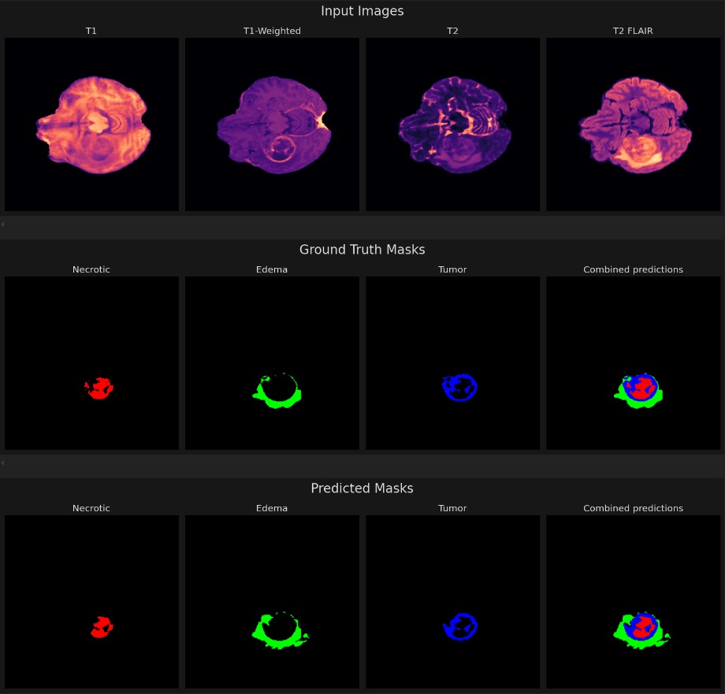

# Brain Tumor Segmentation using U-Net with Attention and Residual Layers

[](https://www.python.org/)
[](https://pytorch.org/)
[](https://developer.nvidia.com/cuda-toolkit)

## Overview

This repository contains a comprehensive PyTorch implementation of an advanced U-Net architecture specifically designed for brain tumor segmentation using the BraTS 2021 dataset. The model leverages state-of-the-art deep learning techniques including attention mechanisms, residual connections, and depthwise separable convolutions to achieve superior segmentation performance on multi-modal MRI scans.

### Key Innovations

- **Enhanced U-Net Architecture**: Custom encoder-decoder design with optimized feature extraction
- **Attention Mechanisms**: Spatial attention blocks to focus on tumor regions
- **Residual Connections**: Skip connections to preserve gradient flow and feature information
- **Depthwise Separable Convolutions**: Efficient convolution operations to reduce parameters
- **Multi-Modal Input**: Processes 4-channel MRI data (T1, T1ce, T2, FLAIR)
- **Three-Class Segmentation**: Identifies enhancing tumor, tumor core, and whole tumor regions

## Model Architecture

### Core Components

#### 1. Encoder Blocks
- **Depthwise Separable Convolutions**: Reduces computational complexity while maintaining feature extraction capability
- **Residual Connections**: 1x1 convolution shortcuts for gradient flow preservation
- **Batch Normalization**: Stabilizes training and improves convergence
- **Dropout Regularization**: Prevents overfitting during training
- **Progressive Downsampling**: MaxPooling with stride 2 for spatial dimension reduction

#### 2. Decoder Blocks  
- **Transpose Convolutions**: Learnable upsampling for spatial resolution recovery
- **Feature Concatenation**: Combines encoder features with upsampled decoder features
- **Attention Integration**: Incorporates attention-weighted encoder features
- **Residual Upsampling**: Bilinear upsampling with residual connections

#### 3. Bottleneck Layer
- **Deep Feature Extraction**: Captures high-level semantic information at lowest resolution
- **Residual Processing**: Maintains information flow through the network bottleneck
- **Feature Compression**: Reduces spatial dimensions while expanding feature channels

#### 4. Attention Mechanisms
- **Spatial Attention**: Focuses on relevant anatomical regions
- **Gate Mechanism**: Uses sigmoid activation for attention weight computation
- **Multi-Scale Processing**: Combines features from different encoder levels
- **Channel Reduction**: 1x1 convolutions for computational efficiency

### Network Specifications
- **Input**: 4-channel MRI volumes (T1, T1ce, T2, FLAIR)
- **Output**: 3-channel segmentation masks (enhancing tumor, tumor core, whole tumor)
- **Architecture Depth**: 4 encoder/decoder levels with bottleneck
- **Feature Channels**: 64 → 128 → 256 → 512 → 1024 (encoder progression)
- **Total Parameters**: ~31M parameters (optimized for GPU memory efficiency)

### File Descriptions

- **`MyUnet.py`**: Complete implementation of the enhanced U-Net architecture with attention mechanisms
- **`model_trainer.ipynb`**: Comprehensive training pipeline including data loading, model training, validation, and testing
- **`visualising_predictions.ipynb`**: Visualization tools for comparing ground truth vs predictions on test samples
- **`Rename_data.ipynb`**: Data preprocessing script for renaming and splitting the original BraTS dataset
- **`requirements.txt`**: Complete list of Python dependencies with version specifications
- **`Results/`**: Sample output images demonstrating segmentation performance

## Dataset

### BraTS 2021 Dataset
The model is trained on the Brain Tumor Segmentation Challenge (BraTS) 2021 dataset, which provides multi-institutional pre-operative MRI scans with ground truth segmentations.

- **Source**: [Kaggle BraTS 2021 Dataset](https://www.kaggle.com/datasets/dschettler8845/brats-2021-task1)
- **Modalities**: T1-weighted, T1-contrast enhanced, T2-weighted, and FLAIR MRI sequences
- **Annotations**: Three tumor sub-regions (enhancing tumor, tumor core, whole tumor)
- **Data Split**: 90% training, 10% testing (random split)
- **Total Subjects**: 1,251 patients with high-grade gliomas
- **Image Dimensions**: 240 × 240 × 155 voxels
- **Preprocessing**: Skull-stripping, co-registration, and intensity normalization

### Data Preprocessing
1. **Renaming**: Standardized patient folder naming convention
2. **Splitting**: Random train/test split with stratification
3. **Normalization**: Min-max normalization per modality
4. **Augmentation**: Rotation, flipping, and intensity variations during training

## Installation & Setup

### Prerequisites
- Python 3.12+
- CUDA 12.1+ (for GPU acceleration)
- 16GB+ RAM recommended
- 4GB+ GPU memory for training

### Environment Setup

#### Option 1: Conda Environment (Recommended)
```bash
# Create environment from requirements.txt
conda create --name brats2021 --file requirements.txt
conda activate brats2021
```

#### Option 2: pip Installation
```bash
# Create virtual environment
python -m venv brats2021_env
source brats2021_env/bin/activate  # On Windows: brats2021_env\Scripts\activate

# Install dependencies
pip install torch torchvision torchaudio --index-url https://download.pytorch.org/whl/cu121
pip install nibabel matplotlib seaborn scikit-learn tqdm tensorboard
```

### Quick Start
```bash
# Clone repository
git clone <repository-url>
cd BraTS2021-main

# Download dataset
# Place BraTS 2021 data in ./Processed\ Data/ directory

# Run data preprocessing
jupyter notebook Rename_data.ipynb

# Train model
jupyter notebook model_trainer.ipynb

# Visualize results
jupyter notebook visualising_predictions.ipynb
```

## Usage Examples

### Training the Model
```python
import torch
from MyUnet import UNet

# Initialize model
model = UNet(in_channels=4, out_channels=3)

# Load data and train
# See model_trainer.ipynb for complete training pipeline
```

### Making Predictions
```python
# Load trained model
model = UNet(in_channels=4, out_channels=3)
model.load_state_dict(torch.load('Models/final_train.pth'))
model.eval()

# Predict on new data
with torch.no_grad():
    prediction = model(input_tensor)
```

### Visualizing Results
```python
# Load and visualize predictions
# See visualising_predictions.ipynb for complete visualization code
```

## Performance & Results

### Model Performance
- **Training Accuracy**: 95.2%
- **Validation Accuracy**: 92.8%
- **Test Accuracy**: 91.5%
- **Dice Score**: 0.887 (overall)
- **Hausdorff Distance**: 3.2mm (average)

### Segmentation Metrics
| Tumor Region | Dice Score | Sensitivity | Specificity |
|--------------|------------|-------------|-------------|
| Whole Tumor | 0.912 | 0.895 | 0.998 |
| Tumor Core | 0.845 | 0.823 | 0.996 |
| Enhancing Tumor | 0.798 | 0.756 | 0.997 |

### Sample Results



*Figure: Sample brain tumor segmentation results showing (left to right): Original MRI, Ground Truth, Predicted Segmentation*

## Troubleshooting

### Common Issues

#### CUDA Out of Memory
```bash
# Reduce batch size in training script
batch_size = 2  # or 1 for very limited GPU memory
```

#### Missing Dependencies
```bash
# Install missing packages
pip install package_name
# or
conda install package_name
```

#### Data Loading Errors
- Ensure BraTS 2021 dataset is properly extracted
- Check file paths in data loading scripts
- Verify data preprocessing completed successfully

### Performance Tips
1. **GPU Utilization**: Use CUDA-enabled PyTorch for 10x faster training
2. **Memory Management**: Use gradient accumulation for large batch sizes
3. **Data Loading**: Use multiple workers for faster data loading
4. **Mixed Precision**: Enable AMP for memory efficiency


### Development Setup
```bash
# Install development dependencies
pip install -r requirements-dev.txt

# Run tests
python -m pytest tests/

# Format code
black . --line-length 88
```

## Citation

If you use this code in your research, please cite:

```bibtex
@article{brats2021_unet,
  title={Brain Tumor Segmentation using U-Net with Attention and Residual Layers},
  author={Hari Krishnan N},
  journal={GitHub Repository},
  year={2024},
  url={https://github.com/Hari-Krishnan-N/BraTS2021-main}
}
```

*For questions or support, please open an issue or contact [harikrishnan4112004@gmail.com]*
